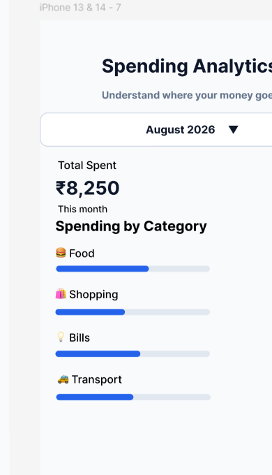
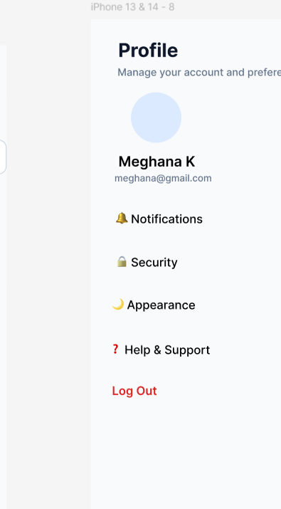
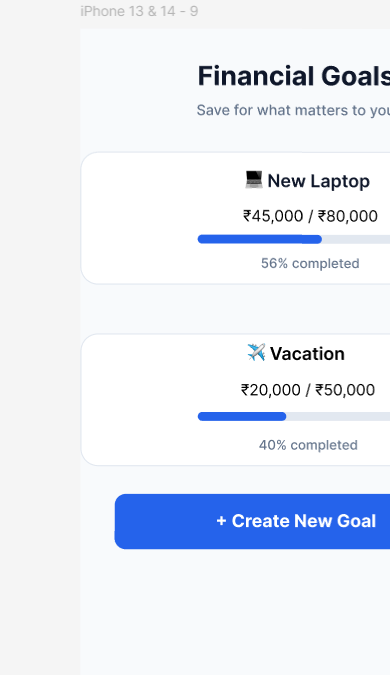

# SmartSpend – Personal Finance App

SmartSpend is a UI/UX personal finance application designed to help
users manage expenses, transactions, spending analytics and financial goals.

## Features

- User Login
- Create Account
- Home Dashboard
- Add Expense
- Transactions
- Spending Analytics
- Profile
- Financial Goals

## UI/UX Design

Designed and prototyped using Figma.

## Figma Prototype

https://www.figma.com/proto/oRn2ADDtkFiflGWMpfL3s6/SmartSpend-%E2%80%93-Personal-Finance-App?node-id=0-1

## Screenshots

### Analytics

### Profile

### Financial Goals

## Tools Used

- Figma
- UI/UX Design
- Prototyping
